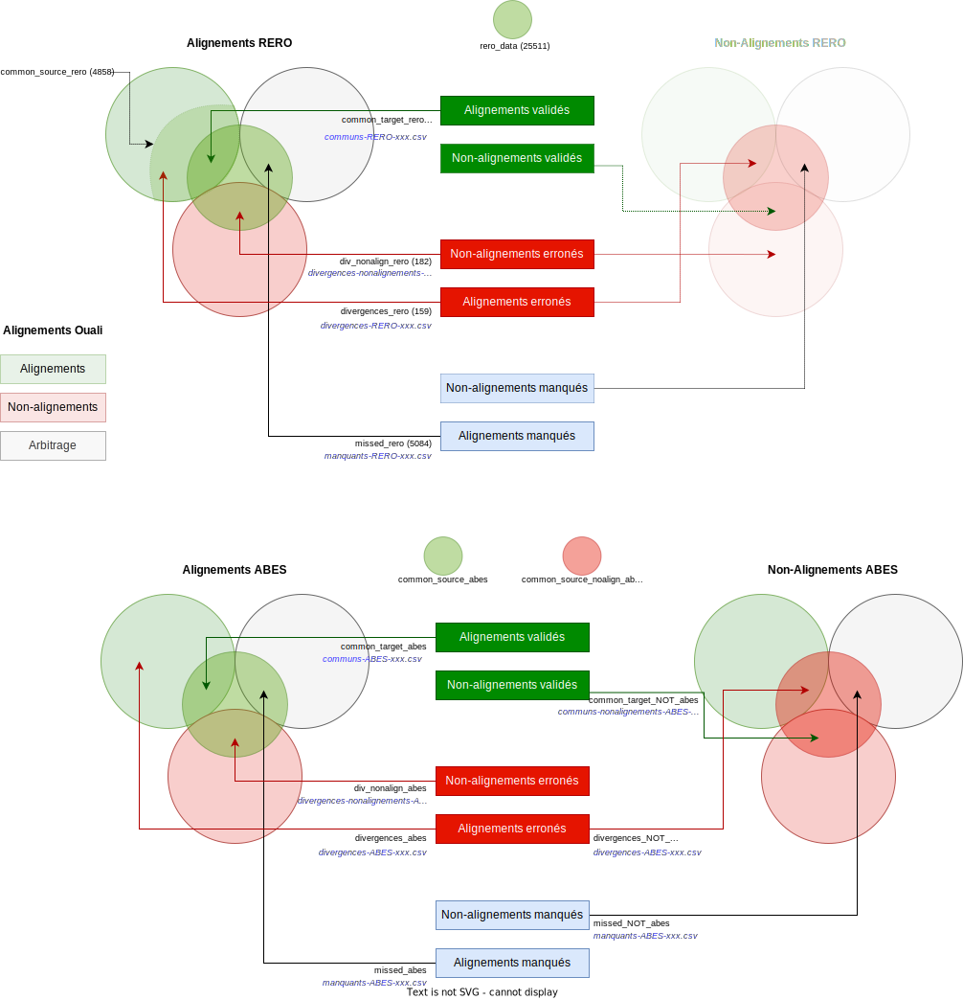

# Projet Ouali - scripts de benchmark et export

Le [réseau de bibliothèques Renouvaud](https://www.bcu-lausanne.ch/mandats/) regroupe 139 institutions dans le canton de Vaud, en Suisse. 
En 2021, la coordination du réseau Renouvaud a entamé un projet de migration de registres d’autorités locales vers le référentiel 
[IdRef](https://www.idref.fr/). 

L'outil Ouali a été développé par l'entrprise [Datuman](http://datuman.ch/) pour mener à bien ce projet. Ouali remplit deux missions:

* Alignement automatique des notices d’autorité provenant des registres locaux vers IdRef
* Aide à l’alignement manuel (arbitrage) lorsqu’un alignement automatique est impossible

Ce dossier GitHub contient des scripts utiles au suivi du projet Ouali. 

### Marche à suivre

Les opérations suivantes sont nécessaires à faire tourner les scripts décrits ici:

1. Extraire et télécharger les rapports Ouali `EstablishedMatchesCSV` et `UndefinedMatchesCSV` (voir ci-dessous)
2. Sauvegarder (et év. renommer) ces rapports dans le dossier `input`
3. Écrire un nouveau fichier de config (ou modifier une config existante) pour prendre en compte les rapports télécharger
4. Appeler le script souhaité (voir ci-dessous)
5. Analyser les résultats dans les fichiers générés dans le dossier `output` (ou tel que défini dans le fichier de config)

### Installer Python et les extensions nécessaires

Les scripts ci-dessous utilisent le language Python 3. Il faut donc avoir au préalable installé Python (version 3.9 ou plus récente) 
sur sa machine pour les faire tourner. Si ce n'est pas déjà le cas, je recommande la distribution 
[Miniconda](https://docs.conda.io/en/latest/miniconda.html#).

Les extensions suivantes sont nécessaires: `pandas`, `yaml` et `gc`. Pour les installer, utiliser le gestionnaire d'extension fourni
avec votre distribution Python, par exemple `pip`:

```
pip install yaml
```

### Extraction des rapports Ouali

Les scripts dont il est mention ici utilisent les rapports de type "CSV" produits par Ouali. Ceux-ci peuvent être générés et téléchargés
depuis l'interface d'admin d'Ouali, individuellement pour chaque instance.

Ouali propose plusieurs types de rapports. Pour l'usage dans ces scripts, **il ne faut pas choisir le rapport Complet**
(au format Excel) mais choisir les fichiers textuels `EstablishedMatchesCSV` (pour les alignements et non-alignements) et
`UndefinedMatchesCSV` (pour les entrées qui restent à aligner).


**NB sur le format des rapports:** Les fichiers textuels produits par Ouali portent l'extension `.csv` ce qui n'est pas entièrement
correct car il ne s'agit pas de valeurs séparées par des virgules (Comma Separated Values) mais par des tabulateurs (Tab Separated Values).
Les esprits tâtillons comme l'auteur des scripts décrits ici prendront alors soin de renommer les fichiers pour qu'ils aient l'extension
`.tsv` au lieu de `.csv` mais cette étape est optionnelle. Les scripts traiteront les rapports correctement qu'ils soient renommés ou non.

### Fichiers de concordance RERO

Les deux scripts nécessitent un fichier de concordance pour faire correspondre les identifiants RERO vers le PPN Alma de Renouvaud.
Ces fichiers (générés par Michaël Hertig) sont au format CSV et doivent inclure au minimum les colonnes suivantes:

| Nom de colonne   | Détails                                                                                         |
|------------------|-------------------------------------------------------------------------------------------------|
| `id`             | PPN Renouvaud, p.ex. `981023303677402851`                                                       |
| `id_rero`        | Identifiant RERO correspondant, de la forme `(RERO)vtls000022969`                               |
| `id_rero_a`      | Optionel, deuxième identifiant RERO correspondant. Seul le premier des deux est pris en compte. |

## Exports pour RERO+

Le travail d'alignement manuel est partagé entre RERO et RenouVaud, car de nombreuses notices d'autorité sont communes aux deux réseaux.
RERO a une longueur d'avance et a déjà fourni un certain nombre d'alignements manuels dont il est tenu compte dans Ouali.

En contrepartie, on veut pouvoir extraire les alignements manuels produits par les Oualinautes et les mettre à disposition de RERO pour
leur propre usage. Le script d'export est là pour extraire les informations pertinentes à RERO des rapports fournis par Ouali.

Le script à appeler est `RERO-export.py`. Celui-ci prend pour seul argument un fichier de configuration YAML 
([voir exemple](config/exportRERO-20220927.yaml)) qui définit le nom des fichiers à utiliser ainsi que le nom du dossier
dans lequel les fichiers d'export pour RERO seront sauvegardés. 
Les chemins vers ces fichiers doivent être relatifs au script `RERO-export.py`.

Les fichiers suivants doivent être fournis au script:

* Un ou plusieurs rapport Ouali de type `EstablishedMatchesCSV`
* Un fichier de concordance RERO

On appelle ensuite le script de la façon suivante:

```
python RERO-export.py config/exportRERO-20220927.yaml
```

En prenant soin bien sûr de remplacer le nom du fichier de config correspondant.

## Benchmark Ouali

Il s'agit ici de comparer le résultat de l'alignement automatique d'Ouali aux alignements validés
fournis par RERO ainsi que ceux calculés par l'ABES. Au fur et à mesure des améliorations sur l'algorithme Ouali, ces scripts sont
utilisés pour mesurer s'il y a amélioration ou non.

Le script à appeler est `ouali-benchmark.py`. Celui-ci prend pour seul argument un fichier de configuration YAML 
([voir exemple](config/nomsATC.yaml)) qui définit le nom des fichiers à utiliser pour la comparaison de chaque instance Ouali. 
Les chemins vers ces fichiers doivent être relatifs au script `ouali-benchmark.py`.

Exemple:

```
python ouali-benchmark.py config/nomsATC.yaml
```

Le résultat de l'analyse est affiché sur la ligne de commande lors de l'exécution du script. Ce dernier génère une série de fichiers
(dans un dossier spécifié en config) comportant les alignements communs et divergents entre Ouali et les sets comparés.

## Définition des sets

Le graphique ci-dessous peut aider à illustrer quels sont les sets de données comparés. Le graphique reprend le nom des variables
utilisées dans le script pour chaque set, ainsi que le nom de base des fichiers d'export:

